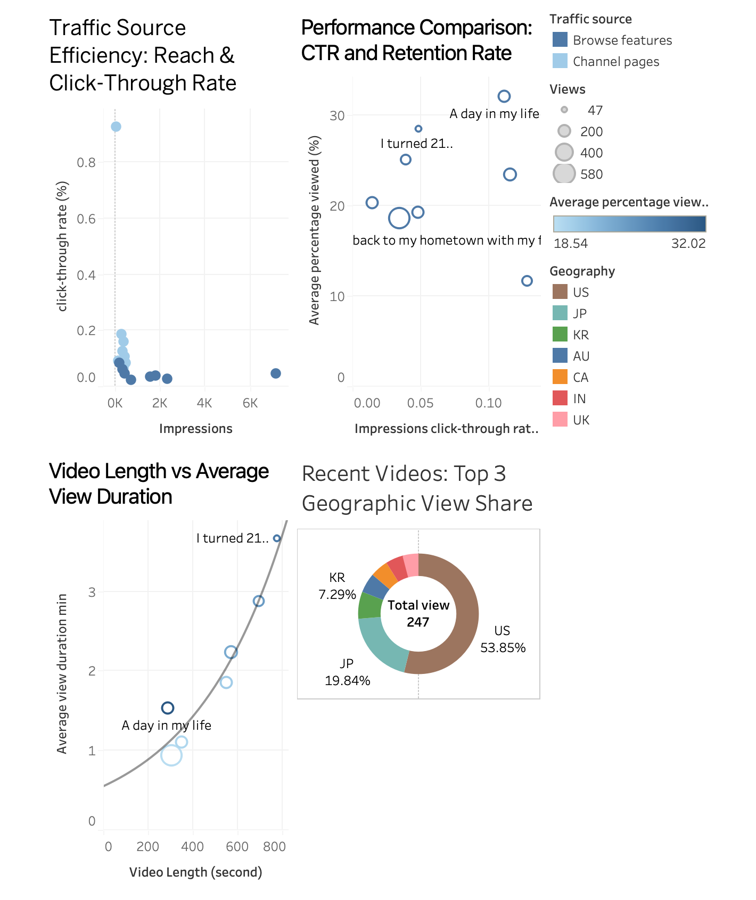

YouTube Channel Data Analysis Portfolio: Driving Content Strategy with Tableau

1. Project Overview

This project showcases data analysis and business intelligence skills by leveraging personal YouTube channel data to identify key performance indicators (KPIs), expose bottlenecks in the content conversion funnel, and develop actionable strategies for audience growth and retention.

The analysis focuses on moving beyond simple view counts to evaluate content quality (Retention Rate) and marketing effectiveness (Click-Through Rate) across different traffic channels.

Key Tools & Technologies Used:

Data Cleaning & Preprocessing: Microsoft Excel

Analysis & Visualization: Tableau Public

Reporting: Markdown

2. Live Dashboard Access

You can interact with the live dashboard and explore the data directly via the link below.
[Open on Tableau Public]
([https://public.tableau.com/views/YoutubePerfomanceAnalysis/Dashboard2?:language=en-US&publish=yes&:sid=&:redirect=auth&:display_count=n&:origin=viz_share_link])

  <!-- Add a line break for spacing -->
  <!-- This tag displays the image -->

3. Core Findings & Strategic Insights

The Tableau dashboard allowed for the formulation of a strict evaluation criteria: Views (Quantity) must be supported by High Retention (Quality).

A. Bottleneck Identification (Reach & Click Efficiency)

Insight: The Traffic Source Efficiency graph (top-left) clearly shows a critical cluster of videos with High Impressions (High Reach) but Extremely Low CTR (Poor Click Efficiency).

Conclusion: This indicates a significant waste of algorithmic reach, primarily in channels like Suggested Videos. The thumbnails and titles are failing to convert viewers despite wide exposure.

B. Content Quality & Success Model

Insight: The CTR and Retention Rate graph (top-right) provides the clearest view of content quality.

Success Model: The "A day in my life" video is positioned ideally (High CTR, High Retention). This format serves as the benchmark for future production.

Critical Evaluation: Videos like "back to my hometown..." have large circles (High Views) but low Retention Rate. This reveals that high view counts alone are misleading; these videos are considered Low-Quality in terms of viewer experience.

C. Actionable Strategy Summary

Prioritized Action (Thumbnail): Focus all A/B testing efforts on the low-CTR, high-impression videos to immediately increase conversion efficiency.

Content Standardization: Adopt the successful structural elements (theme, pace, opening) of the "A day in my life" video.

Market Focus: Prioritize content for the dominant US (53.85%) and JP (19.84%) markets, while strategically engaging the growing third market, KR (7.29%), through localization (subtitles).
